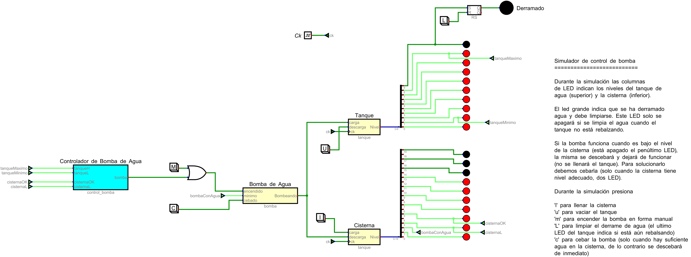
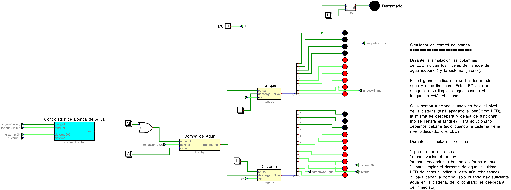
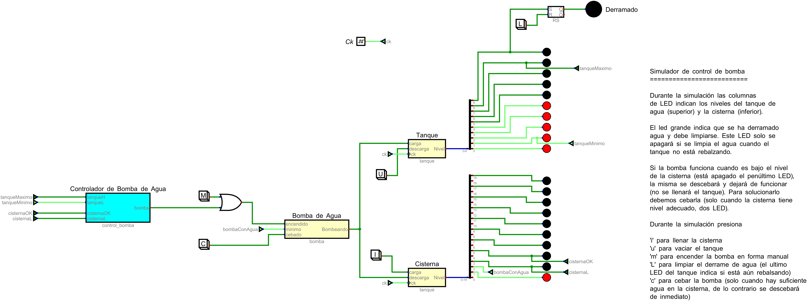

# Informe de Desarrollo de un Controlador Digital de Bomba de Agua

Electrónica IV - TP - Automatismos y Máquinas Elementales

## Introducción

Un controlador de bomba de agua es un circuito que se encarga de prender y apagar una bomba de agua con el objetivo de bombear agua de una cisterna hasta un tanque. La bomba solamente puede prenderse cuando hay suficiente agua en la cisterna y debe apagarse una vez se haya llenado el tanque. Además, no debe volver a prenderse hasta que el tanque se haya descargado hasta un nivel minimo.

## Metodología de trabajo

En primer lugar, analizaremos en qué casos la bomba estará prendida. Para ello dividiremos el problema en dos: en qué casos la bomba puede estar encendida (de acuerdo con la cantidad de agua en la cisterna) y los casos en la que la bomba tiene que encenderse (de acuerdo con la cantidad de agua en el tanque). La bomba solo se encenderá en los casos en que pueda estar encendida y tenga que estar encendida simultáneamente, en cualquier otro caso, la bomba permanecerá apagada. 
Por simplicidad, utilizaremos los siguientes nombres:
CisternaL  = Cl
CisternaOK = Cok
TanqueL    = Tl
TanqueH    = Th

Primero analizaremos en qué casos la bomba puede estar encendida. 

-Cuando el agua en la cisterna está por debajo del nivel mínimo (Cl=0 y Cok=0) la bomba no puede estar prendida.
- Cuando el nivel de agua se encuentra entre los dos sensores (Cl=1 y Cok=0) ocurrirán dos casos. Si la cisterna se estaba cargando, la bomba no puede prenderse (ya que Cok es el nivel de agua que debe tener la cisterna para que la bomba pueda encenderse) y si la cisterna se estaba descargando, la bomba puede estar prendida, ya que esta debe apagarse una vez que se llega al nivel mínimo de agua (Cl=0).
En otras palabras, si la bomba estaba apagada (cisterna cargándose) debe permanecer apagada, y si la bomba estaba encendida (cisterna descargándose), puede permanecer encendida. Por lo tanto, deberemos utilizar algún elemento de memoria que nos permita guardar el estado en el que se encontraba la bomba.
-Cuando el nivel de agua se encuentra por encima del nivel suficiente para encender la bomba (Cl=1 y Cok=1), la bomba puede prenderse.

Es decir, tenemos lo siguiente
Cok=Cl=0 bomba apagada (Bc=0)
Cok=Cl=1 bomba encendida (Bc=1)
Cok=0 Cl=1 mantiene estado 

Donde Bc indica si la bomba puede estar o no prendida 
Para recordar en que estado se encuentra la bomba utlizaremos un flip flop S-R.  En la entrada de set se conectará la señal Cl negada (notCl), en la entrada de reset se conectará la señal Cok y la señal que nos indica si la bomba puede o no estar prendida (Bc) se conectará a Q negado (notQ). Tendremos lo siguiente

Cl Cok  S R | Q  notQ  Bc
0   0   1 0 | 1   0    0
1   0   0 0 | mantiene estado  
1   1   0 1 | 0   1    1

Observamos que no se dará el estado no permitido S=R=1 ya que no puede ocurrir Cl=0 y Cok=1 (si todos los sensores estan funcionando correctamente)

Realizamos el mismo analisis para el segundo caso, es decir, para cuando la bomba debe encenderse ( de acuerdo con los niveles de agua del tanque). Analicemos los casos en los que la bomba deberia prenderse

-Si el nivel de agua del tanque esta por debajo del nivel minimo (Tl=0 y Th=0), la bomba debe prenderse
-Si el nivel de agua del tanque se encuentra entre los dos sensores (Tl=1 y Th=0) ocurriran dos casos. Si el tanque se estaba cargando, la bomba debe permanecer prendida hasta que se llegue al nivel maximo de agua. Si el tanque se esta descargando, la bomba no debe prenderse hasta que se llegue al nivel minimo de agua. Es decir, si la bomba estaba encendida (tanque cargandose) esta debe permananecer en dicho estado, en cambio si la bomba esta apagada (tanque descargandose) esta debe permanecer apagada. Al igual que en el caso de la cisterna, deberemos utilizar un elemento de memoria para recordar en que estado se encuentra la bomba.
- Si se llegó al nivel maximo de agua (Tl=1 y Th=1) la bomba debe apagarse.

Es decir, tenemos lo siguiente
Tl=Th=0 bomba encedida (Bt=1)
Tl=Th=1 bomba apagada  (Bt=0)
Tl= 1 Th=0 mantiene estado

donde Bt nos indica si la bomba debe prenderse

Al igual que en el caso anterior utilizaremos un flip flop S-R para recordar el estado en el que se encuentra la bomba. A la entrada de set estará conectada la señal Tl negada (notTl), a la entrada de reset se conectara la eñal Th y la señal indicadora Bt se conecta a la salida Q.

Tl  Th  S R | Q   Bt
0   0   1 0 | 1    1
1   0   0 0 | mantiene estado  
1   1   0 1 | 0    0

Observamos que en este caso tampoco se dará el estado no permitido S=R=1 ya que no puede darse que Tl=0 y Th=1.

Finalmente, como habiamos mencionado anteriormente, la bomba solo se encendera cuando se den simultaneamente los casos en que la bomba pueda y deba estar encendida. Es decir, la bomba se prenderá solo cuando Bt=1 y Bc=1, en el resto de los casos la bomba estará apagada. Para esto, utilizaremos una compuerta AND. Si llamamos B a la señal que indica si la bomba esa encendida (si B=1 la bomba esta encendida y si B=0 la bomba esta apagada), el resultado seria el siguiente

Bc  Bt | B = Bc and Bt
0   0  |      0
0   1  |      0
1   0  |      0
1   1  |      1

## Resultados

Al realizar la simulación, se pudo observar que la bomba solo se enciende cuando hay suficiente agua en la cisterna, manteniendo el nivel de agua del tanque entre los niveles Tl y Th.

En la siguiente imagen, vemos que el tanque solo se carga hasta Th

En la siguiente imagen, vemos que, una vez que el tanque se empieza a descargar, no se vuelve a cargar hasta que llegue al nivel Tl, a pesar de que la cisterna tiene un nivel de agua sufuciente.

Por ultimo, podemos ver que el tanque no se llena cuando el nivel de agua en la cisterna no es el suficiente

## Conclusiones

De acuerdo a lo explicado anteriormente, podemos concluir que el controlador de bomba de agua es un automatismo, puesto que realiza una tarea especifica (controlar la carga de un tanque) sin necesidad de que se intervenga manualmente. Al realizar la simulacion, pudimos ver que, siempre que hubiese suficiente agua en la cisterna, el tanque se cargaba automaticamente hasta llegar al nivel maximo sin necesidad de que uno tenga que cargar manualmente el tanque. Es decir, pudimos observar que el encendido y apagado de la bomba (y la consecuente carga del tanque) se da de manera automática.