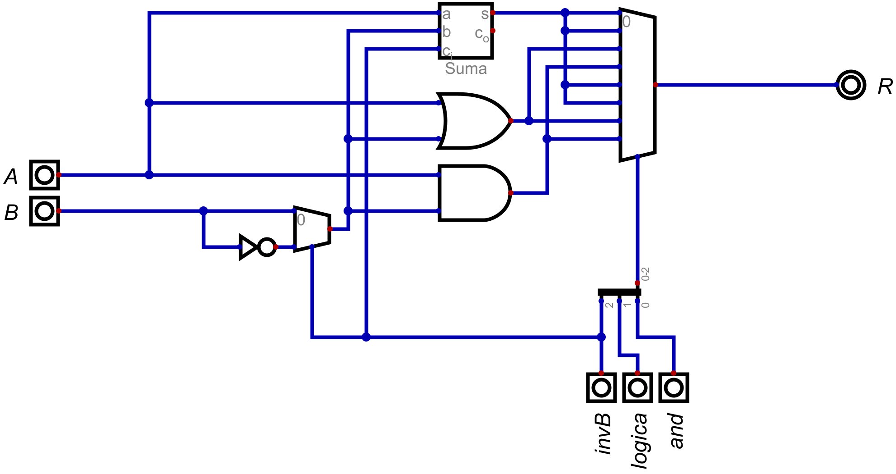
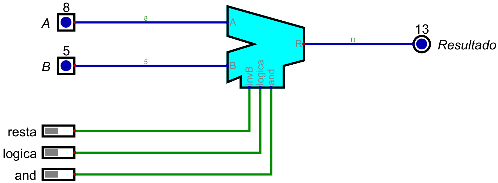
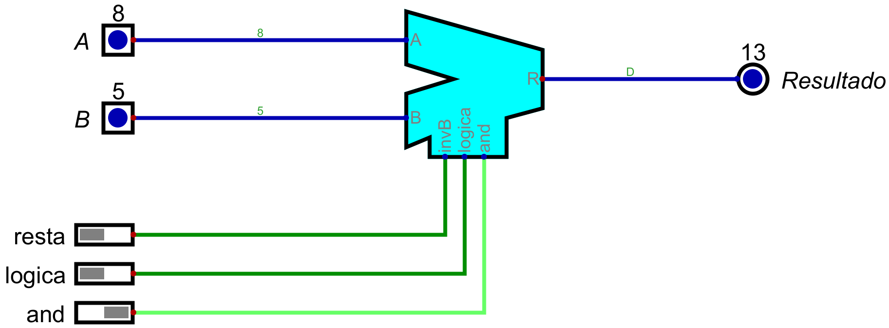
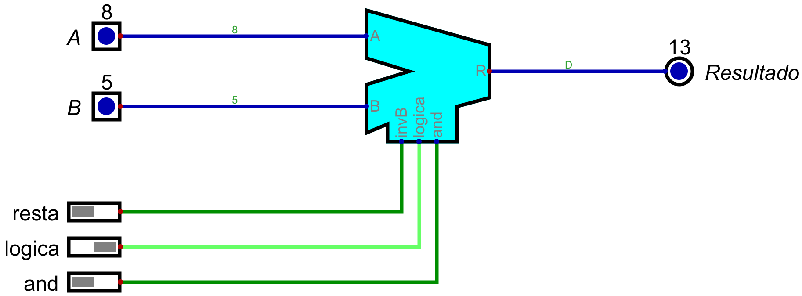
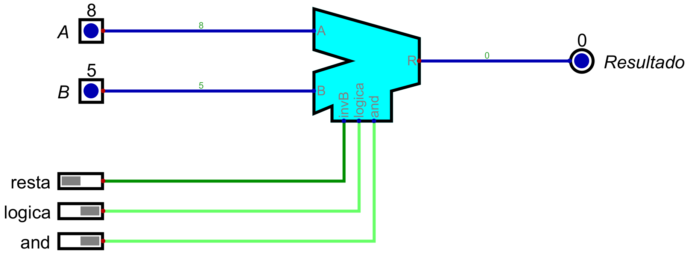
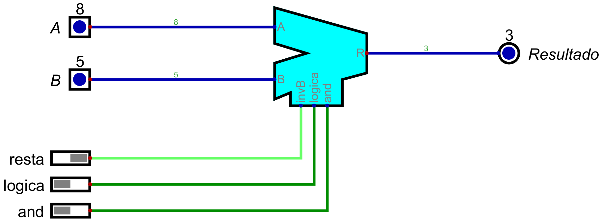
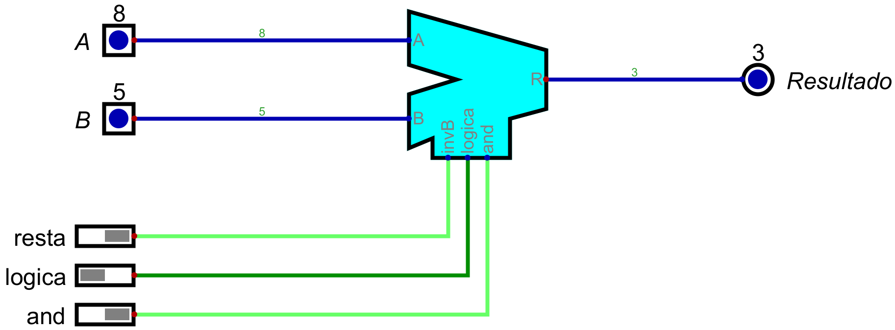
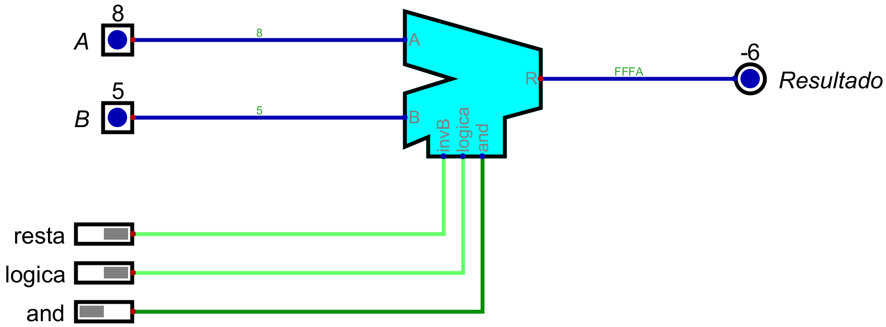
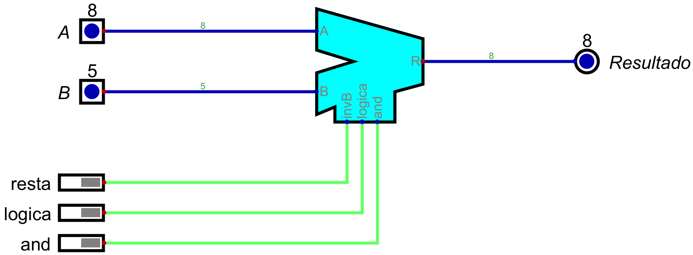

# Informe de Desarrollo de una Unidad Aritmética Lógica (ALU) de 16 bit

Electrónica IV - TP - Automatismos y Máquinas Elementales

## Introducción

La Unidad Arimético Logica (ALU) en la CPU del procesador se encarga de realizar operaciones arimeticas con datos numericos expresados en sistema binario. Estas operaciones incluyen la suma, resta, producto y division. Las operaciones se realizan del mismo modo que en el sistema decimal, pero debido a la sencillez del sistema de numeracion se pueden hacer simplificaciones que facilitan la realizacion de las operaciones.

## Metodología de trabajo

En primer lugar, veamos cuales son los distintos modos de operación 

invB  logico  and | resultado
 0      0      -  |  A + B
 0      1      0  |  A OR B
 0      1      1  |  A AND B
 1      0      -  |  A - B
 1      1      0  |  A OR (notB)
 1      1      1  |  A AND (notB)

Los primero que podemos notar es que resultado dependerá del valor que tomen las señales invB, logico y and. 
Observamos entonces, que para poder elegir entre los distintos modos de operación, podemos utilizar un multiplexor de 8 a 1 con una entrada de selección de 3 bits donde cada bit corresponderá a una de las tres señales de control.

Para realizar la suma utilizaremos el sumador que se encuentra en el simulador Digital. Para realizar la resta, podriamos utilizar el restador que forma parte de los componentes provistos por el simulador. Sin embargo, como sabemos que

(A-B)c2 = A + (-B) = A + notB +1

también podemos utilizar un sumador para realizar la resta.

Entonces, los modos de operación serían los siguientes:

invB  logico  and | resultado
 0      0      -  |  A + B
 0      1      0  |  A OR B
 0      1      1  |  A AND B
 1      0      -  |  A + (notB) + 1
 1      1      0  |  A OR (notB)
 1      1      1  |  A AND (notB)

 Por otro lado, observamos que siempre que invB sea igual a 1, vamos a trabajar con B negado, y cuando invB es igual a cero, trabajaremos con B. Para poder seleccionar si trabajamos con B o con B negado utilizaremos un multiplexor de 2 a 1 con entrada de selección de 1 bit
 A la entrada de selección conectaremos la señal invB, y a las entradas de datos conectaremos las señales B y B negado. Así, si invB es igual a 1 (entrada de selección igual a 1) la salida será B negado (notB), y si invB es igual a 0 (entrada de selección igual a 0), la salida será B. Por conveniencia, llamaremos "sumandoB" a la salida del multiplexor 2 a 1.

De esta manera, seremos capaces de realizar las operaciones lógicas y aritméticas utilizando solamente una compuerta AND, una compuerta OR y un sumador. 
Observamos que, si conectamos a las entradas de la compuerta AND las señales "A" y "sumandoB" (cuyo valor será B o notB de acuerdo al valor de invB), la operación que realizará será:

A AND B    si invB=0
A AND notB si invB=1

Y lo mismo sucederá para la compuerta OR.

En el sumador, ademas de las entradas de datos (números que se quieren sumar), también esta la entrada de acarreo Ci. Si esta entrada se pone en 1, el resultado de la suma se incrementa en 1, si esta entrada se pone en 0, no ocurre este incremento.
Si conectamos las entradas de datos del sumador a las señales "A" y "sumandoB", y la entrada de acarreo a la señal invB, obtendremos a la salida

A + B         si invB=0
A + notB + 1  si invB=1 

Es decir, que si invB es igual a 0, a la salida del sumador obtedríamos como resultado la suma A+B y si invB es igual a cero, el resultado sería la resta A-B.

Finalmente, conectamos las salidas de las compuertas AND, OR y del sumador a las entradas correspondientes del multiplexor 8 a 1. 

## Resultados
El circuito final es el siguiente

En base al procedimiento descripto anteriormente, realizamos la simulación de la ALU utilizando el simulador DIGITAl.
En la simulación, se elegieron los valores 8 y 5 para las señales A y B respectivamente. Luego, se vieron las resultados al variar las señales de control. 

invB  logico  and |  imagen del resultado
 0      0      0  |  
 0      0      1  |  
 0      1      0  |  
 0      1      1  |  
 1      0      0  |  
 1      0      1  |   
 1      1      0  |  
 1      1      1  |  

## Conclusiones

Podemos concluir que la ALU es una maquina elemental ya que realiza una tarea o funcion basica.
